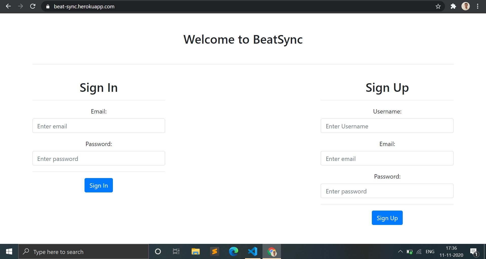
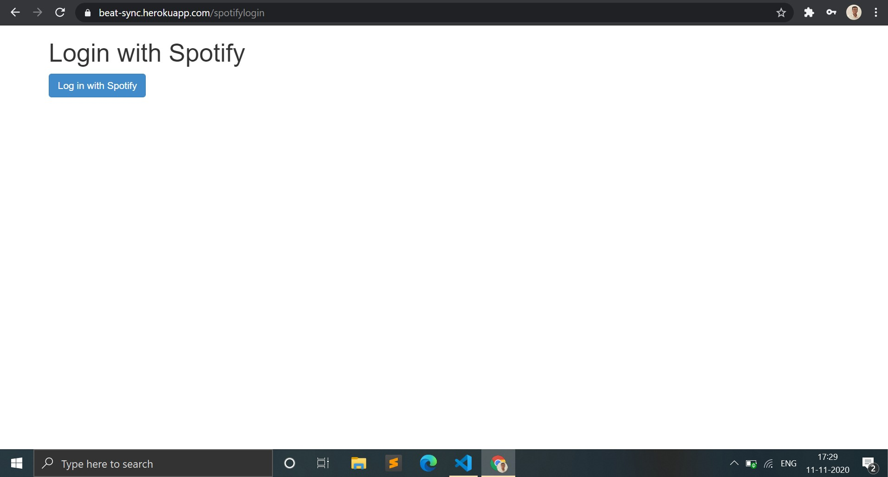
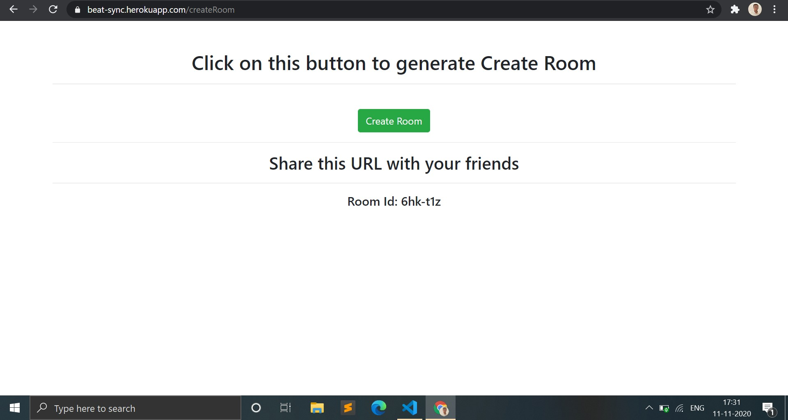
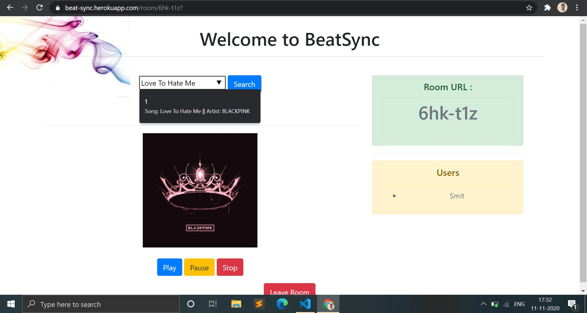

# BeatSync
 
BeatSync is a collaborative web application which allows to listen to music together in Sync.

## Description
BeatSync is a cross web collaborative platform that enables users to host a spotify party and listen to the every beat in perfect synchronization.
Any user can sign up, create a room, invite fellow participants using the unique room key and seal the deal!
_Note: Since this application is in its alpha stage, user require spotify premium to have access to playbck control._ 

## Installation
Clone the repo and install [npm](https://docs.npmjs.com/downloading-and-installing-node-js-and-npm)
Download the dependencies on your pc by running the following command:
```bash
npm install
```

You can directly start your server at [localhost:3000](localhost:3000) by:
```bash
npm start
```
Alternatively, you can install nodemon and start your server using nodemon

```bash
npm install -dev nodemon --save
```

```bash
nodemon app.js
```

## Technology Stack
* NodeJS
* ExpressJS
* Mongo Cloud Atlas
* Socket.io
* Jquery and Ajax
* Spotify API
* jsonwebtoken

## Web Snaps





## Running tests

In order to run the tests, run:

    $ npm test

If you want to check out the coverage, run:

    $ npm run test:coverage

## Usage
Can be used as reference for creating host-user model rooms using Web Sockets.

Implementation of the following Spotify API Endpoints:
* Spotify Authentication
* Get the User's Device Id
* Spotify Search
* Retrieve and play any track
* Pause a track
* Resume playing a track

For any queries, feel free to contact at smitu3435@gmail.com

## Credits
Smit Patel
Dibyanshu Pranjal
Saloni Sawarkar
